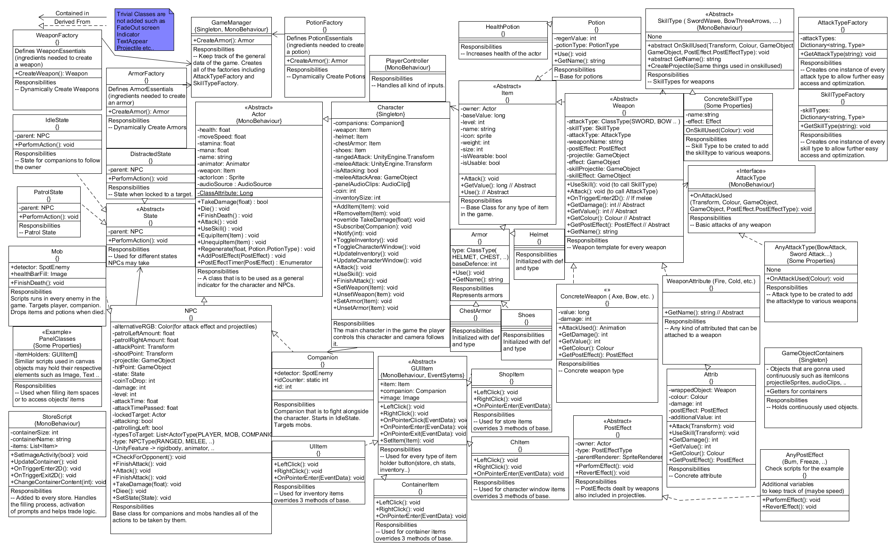

# KingsRaid

Playable Link: https://vahsi.itch.io/kings-raid

<h3>Introduction</h3>

The first game I made with Unity. My main purpose of making this game was to learn core Unity features and to implement basic RPG features such as Inventory-Store-Character Screen system, Item system includes various types with dynamic creation, Companion-Enemy AI system, and other simple implementations.

<h3>About The Game</h3>

Simple dungeoneer like game where you can buy weapons, armors, and potions. In addition to this, for a reasonable price a companion can be bought. Every weapon may have additional enchanment such as ice or fire, and every weapon has its own skill attack. After completion of each level the items in the stores are updated with more sophisticated ones. Approximately 75 enemies will spawn at each level and they gradually get stronger as the player passes the levels.

<h3>Design</h3>

The class diagram of the game can be seen below:

To clarify the class diagram:

Strategy Pattern is used in order to implement SkillType and AttackType. By doing this, easy creation of types achieved by just creating a single class then using it on the dynamic creation of the various weapons.

Decorator Pattern is used in order to implement Weapons where ConcreteWeapon is the plain weapon and WeaponAttributes can be wrapped around a Weapon object which eases the creation and the use of more complex weapons.

State Pattern is used in order to ease the implementation and reusability of the NPCs.

Observer Pattern is used to implement Companion-Character relationship for commands.

Various Factories are used to create Weapons, Armors, and Potions dynamically and to create all Types of SkillType and AttackType which are used many times in the game.
